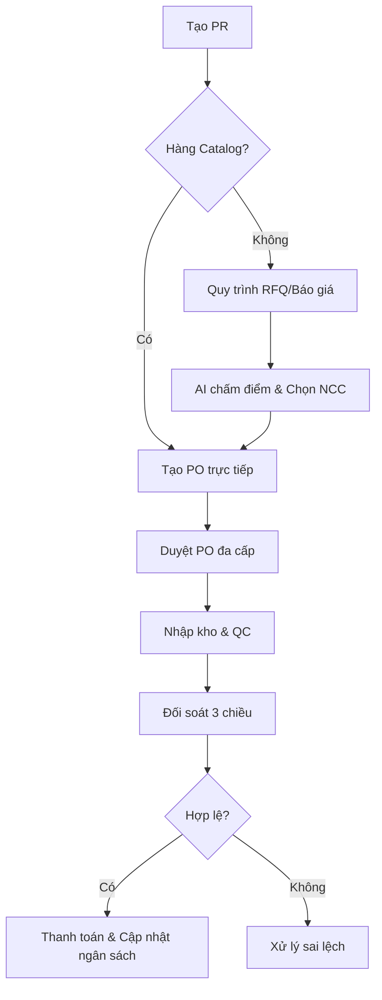

# 🚀 Smart E-Procurement & Order Management System (OMS)

[](https://nextjs.org/)
[](https://react.dev/)
[](https://nestjs.com/)
[](https://www.typescriptlang.org/)
[](https://www.prisma.io/)
[](https://www.postgresql.org/)
[](https://tailwindcss.com/)
[](https://ai.google.dev/)

Hệ thống quản trị mua sắm tập trung (**E-Procurement**) và Quản lý đơn hàng (**OMS**) toàn diện theo chuẩn Enterprise. Tích hợp AI (Gemini) để tự động hóa chu trình **Procure-to-Pay**, kiểm soát ngân sách và phê duyệt đa cấp.

---

## ✨ Tính Năng Nổi Bật

1.  **Quy trình Mua sắm Kép (Dual-Flow):** Tự động phân loại hàng CATALOG (tạo PO trực tiếp) và NON-CATALOG (qua quy trình RFQ/Báo giá).
2.  **Đối soát 3 chiều Thông minh (3-Way Matching):** Tự động khớp Hóa đơn - Phiếu nhập kho (GRN) - Đơn mua hàng (PO) với sai số cho phép.
3.  **Đánh giá Nhà cung cấp Real-time:** Tự động tính điểm KPI (giao hàng đúng hạn, chất lượng, phản hồi) và phân hạng bằng AI.
4.  **Quản lý Ngân sách Đa tầng:** Kiểm soát ngân sách theo Trung tâm chi phí (Cost Center), Phòng ban và Danh mục hàng hóa.
5.  **Luồng Phê duyệt 3 Cấp:** Tự động điều hướng phê duyệt dựa trên giá trị đơn hàng (Tài chính -> Giám đốc -> CEO) kèm theo SLA và Escalation.
6.  **Trợ lý ảo CPO AI:** Tích hợp Gemini Flash để phân tích báo giá, truy vấn dữ liệu tự nhiên và đưa ra khuyến nghị mua sắm.
7.  **Tự động hóa Toàn diện:** Tự động chuyển đổi chứng từ (PR -> RFQ -> PO -> GRN -> Invoice) giúp giảm thiểu thao tác thủ công.
8.  **Bảo mật Enterprise:** Phân quyền chi tiết (RBAC), ghi log thay đổi (Audit Trail) và mã hóa dữ liệu nhạy cảm.

---

## 🏗️ Kiến trúc & Công nghệ

### Hệ sinh thái Công nghệ
- **Frontend:** Next.js 16 (App Router), React 19, TailwindCSS 4, Shadcn/ui.
- **Backend:** NestJS 11, Prisma ORM 7.5, PostgreSQL 16.
- **Infrastructure:** Redis (BullMQ cho hàng đợi công việc), Socket.io (Real-time).
- **AI Integration:** Google Gemini Flash (Function Calling, Analysis).

### Sơ đồ Quy trình Procure-to-Pay



---

## 🛠️ Hướng dẫn Cài đặt & Chạy

### 1. Yêu cầu hệ thống
- **Node.js:** v18.17+
- **Database:** PostgreSQL 16 & Redis 7 (Có thể chạy qua Docker)

### 2. Thiết lập Backend
```bash
cd server
npm install
cp .env.example .env # Cấu hình DATABASE_URL, REDIS_HOST, GEMINI_API_KEY
npx prisma db push
npx ts-node prisma/seed.ts # Khởi tạo dữ liệu cơ bản
npm run start:dev
```

### 3. Thiết lập Frontend
```bash
cd client
npm install
cp .env.local.example .env.local # Cấu hình NEXT_PUBLIC_API_URL
npm run dev
```

---

## 📖 Dữ liệu Seed & Kiểm thử

Hệ thống cung cấp các bộ dữ liệu mẫu chuyên sâu:
- **Tổ chức:** FPT Corporation, FPT Software, FPT Shop.
- **Quy tắc phê duyệt:** 3 cấp dựa trên hạn mức (0-500M, 500M-1B, >1B).
- **Danh mục:** 15+ danh mục hàng hóa (Laptop, Linh kiện, Dịch vụ phần mềm...).

**Lệnh Seed nâng cao:**
```bash
npx ts-node prisma/seed_budget_approval_rules.ts
npx ts-node prisma/seed_fpt_software.ts
npx ts-node prisma/seed_fpt_shop.ts
```

---

## 📂 Cấu trúc Thư mục Chính

- `/client/app`: Chứa các trang nghiệp vụ theo Dashboard (PR, PO, RFQ, Budget, Approval...).
- `/server/src`: Gồm các module nghiệp vụ chính:
  - `approval-module`: Động cơ phê duyệt linh hoạt.
  - `budget-module`: Quản lý cấp phát và giữ chỗ ngân sách.
  - `automation-module`: Tự động hóa chuyển đổi chứng từ.
  - `ai-service`: Tích hợp logic AI Gemini.
- `server/prisma/schema.prisma`: Định nghĩa toàn bộ cấu trúc Database. [Xem chi tiết tại đây](./server/prisma/schema.prisma)

---

## 👨‍💻 Thông tin Phát triển

- **Tác giả:** Nguyễn Đình Nam
- **Email:** nguyendinhnam241209@gmail.com
- **Trạng thái:** ✅ Hoàn thiện 99% - Sẵn sàng vận hành.
- **License:** Proprietary (FPT Corporation).

---
*Cập nhật lần cuối: Tháng 4, 2026*
