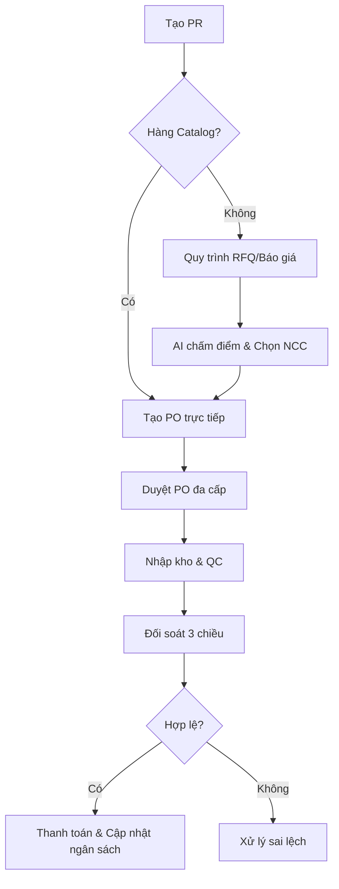

# 🚀 Smart E-Procurement & Order Management System (OMS)

[](https://nextjs.org/)
[](https://react.dev/)
[](https://nestjs.com/)
[](https://www.typescriptlang.org/)
[](https://www.prisma.io/)
[](https://www.postgresql.org/)
[](https://tailwindcss.com/)
[](https://ai.google.dev/)

Hệ thống quản trị mua sắm tập trung (**E-Procurement**) và Quản lý đơn hàng (**OMS**) toàn diện theo chuẩn Enterprise. Tích hợp AI (Gemini) để tự động hóa chu trình **Procure-to-Pay**, kiểm soát ngân sách và phê duyệt đa cấp.

---

## ✨ Tính Năng Nổi Bật

1.  **Quy trình Mua sắm Kép (Dual-Flow):** Tự động phân loại hàng CATALOG (tạo PO trực tiếp) và NON-CATALOG (qua quy trình RFQ/Báo giá).
2.  **Đối soát 3 chiều Thông minh (3-Way Matching):** Tự động khớp Hóa đơn - Phiếu nhập kho (GRN) - Đơn mua hàng (PO) với sai số cho phép.
3.  **Đánh giá Nhà cung cấp Real-time:** Tự động tính điểm KPI (giao hàng đúng hạn, chất lượng, phản hồi) và phân hạng bằng AI.
4.  **Quản lý Ngân sách Đa tầng:** Kiểm soát ngân sách theo Trung tâm chi phí (Cost Center), Phòng ban và Danh mục hàng hóa.
5.  **Luồng Phê duyệt 3 Cấp:** Tự động điều hướng phê duyệt dựa trên giá trị đơn hàng (Tài chính -> Giám đốc -> CEO) kèm theo SLA và Escalation.
6.  **Trợ lý ảo CPO AI:** Tích hợp Gemini Flash để phân tích báo giá, truy vấn dữ liệu tự nhiên và đưa ra khuyến nghị mua sắm.
7.  **Tự động hóa Toàn diện:** Tự động chuyển đổi chứng từ (PR -> RFQ -> PO -> GRN -> Invoice) giúp giảm thiểu thao tác thủ công.
8.  **Bảo mật Enterprise:** Phân quyền chi tiết (RBAC), ghi log thay đổi (Audit Trail) và mã hóa dữ liệu nhạy cảm.

---

## 🏗️ Kiến trúc & Công nghệ

### Hệ sinh thái Công nghệ
- **Frontend:** Next.js 16 (App Router), React 19, TailwindCSS 4, Shadcn/ui.
- **Backend:** NestJS 11, Prisma ORM 7.5, PostgreSQL 16.
- **Infrastructure:** Redis (BullMQ cho hàng đợi công việc), Socket.io (Real-time).
- **AI Integration:** Google Gemini Flash (Function Calling, Analysis).

### Sơ đồ Quy trình Procure-to-Pay



---

## � Quy trình Nghiệp vụ Chi tiết

### 1️⃣ Quy trình Đặt hàng từ PR đến Thanh toán & Ký hợp đồng

Hệ thống triển khai chuẩn Procure-to-Pay (P2P) với kiểm soát ngân sách đa tầng và 3-Way Matching tự động.

#### **Giai đoạn 1: PR (Purchase Requisition) - Yêu cầu mua sắm**

```
┌─────────┐    ┌──────────────────┐    ┌───────────┐    ┌─────────────┐
│  DRAFT  │───→│PENDING_APPROVAL  │───→│  APPROVED │───→│IN_SOURCING  │
│  (Nháp) │    │  (Chờ duyệt)     │    │ (Đã duyệt)│    │(Tạo RFQ)    │
└─────────┘    └──────────────────┘    └───────────┘    └─────────────┘
     │                │
     │                │
     ▼                ▼
┌─────────────────────────────────────────────────────────────────────┐
│                      BUDGET CHECK KHI TẠO PR                          │
├─────────────────────────────────────────────────────────────────────┤
│ • Kiểm tra ngân sách theo Cost Center + Category                      │
│ • Công thức: Available = Allocated - Committed - Spent                │
│ • Nếu thiếu budget: Báo lỗi hoặc tạo Budget Override Request            │
└─────────────────────────────────────────────────────────────────────┘
                              │
                              ▼
┌─────────────────────────────────────────────────────────────────────┐
│                      BUDGET RESERVE KHI SUBMIT                        │
├─────────────────────────────────────────────────────────────────────┤
│ • Committed Amount += Total Estimate                                  │
│ • Kiểm tra lại available sau khi reserve                              │
│ • Auto rollback nếu vượt hạn mức                                        │
└─────────────────────────────────────────────────────────────────────┘
```

**Checkpoint quan trọng:**
- **Role-based Ceiling:** Giới hạn tạo PR theo chức vụ
  - < 10tr: REQUESTER+
  - 10-30tr: DEPT_APPROVER+
  - 30-100tr: DIRECTOR+
  - > 100tr: CEO only
- **Multi-level Approval:** Tự động routing phê duyệt dựa trên giá trị PR

#### **Giai đoạn 2: RFQ (Request for Quotation) - Yêu cầu báo giá**

```
┌────────────┐    ┌────────────┐    ┌────────────┐    ┌────────────┐
│    SENT    │───→│  SUPPLIER  │───→│  QUOTATION │───→│  AWARDED   │
│  (Đã gửi)  │    │   (Nhận)   │    │ (Báo giá)  │    │ (Trao thầu)│
└────────────┘    └────────────┘    └────────────┘    └──────┬─────┘
      │                                                      │
      │         Copy items từ PR                             │
      │         Mời nhiều suppliers                           │
      │         Gửi email notification                       │
      │                                                      ▼
      │                                             ┌────────────┐
      └────────────────────────────────────────────→│ Tạo PO     │
                                                  │  tự động    │
                                                  └────────────┘
```

**Luồng Negotiation (nếu cần):**
```
Quotation Submitted → Counter Offer (Buyer) → Supplier Response (Accept/Reject) → Award
```

#### **Giai đoạn 3: PO (Purchase Order) - Đơn đặt hàng**

```
┌────────┐    ┌────────┐    ┌────────┐    ┌────────┐    ┌────────┐    ┌────────┐
│  DRAFT │───→│ ISSUED │───→│ACKNOWL.│───→│CONFIRM │───→│ SHIPPED│───→│GRN_CR. │
│        │    │        │    │ EDGED  │    │  ED    │    │        │    │ EATED  │
└────────┘    └────────┘    └────────┘    └────────┘    └────────┘    └────────┘
     │                                                        │
     │           Budget Reserve (khi tạo PO)                  │
     │           Committed += PO Total                          ▼
     │                                                 ┌────────┐
     │                                                 │INVOICED│
     │                                                 └────────┘
```

#### **Giai đoạn 4: GRN (Goods Receipt Note) - Nhận hàng**

```
┌─────────────────────────────────────────────────────────────────────┐
│                      GRN PROCESS                                      │
├─────────────────────────────────────────────────────────────────────┤
│                                                                       │
│  1. Warehouse nhận hàng → Tạo GRN                                    │
│  2. Check Quantity: receivedQty vs PO qty                             │
│  3. Quality Control (QC): acceptedQty vs receivedQty                │
│  4. GRN Status: DRAFT → CONFIRMED                                     │
│  5. Auto check: Nếu nhận đủ → PO status = GRN_CREATED                 │
│                                                                       │
└─────────────────────────────────────────────────────────────────────┘
```

#### **Giai đoạn 5: 3-Way Matching - Đối soát 3 chiều**

```
╔═══════════════════════════════════════════════════════════════════════╗
║                         3-WAY MATCHING                                  ║
╠═══════════════════════════════════════════════════════════════════════╣
║                                                                        ║
║   ┌──────────────┐     ┌──────────────┐     ┌──────────────┐        ║
║   │   PO DATA    │     │   GRN DATA   │     │ INVOICE DATA │        ║
║   │  (Qty/Price) │     │(Qty Received)│     │(Qty/Price)   │        ║
║   └──────┬───────┘     └──────┬───────┘     └──────┬───────┘        ║
║          │                    │                    │                 ║
║          └────────────────────┴────────────────────┘                 ║
║                               │                                       ║
║                    ┌──────────▼──────────┐                            ║
║                    │     TOLERANCE       │                            ║
║                    │  • Qty: ±2%         │                            ║
║                    │  • Price: ±1%       │                            ║
║                    └──────────┬──────────┘                            ║
║                               │                                       ║
║              ┌────────────────┼────────────────┐                      ║
║              ▼                ▼                ▼                      ║
║        ┌──────────┐     ┌──────────┐     ┌──────────────┐              ║
║        │ MATCH OK │     │ EXCEPTION│     │  REJECTED    │              ║
║        │AUTO_APPR │     │  REVIEW  │     │              │              ║
║        └──────────┘     └──────────┘     └──────────────┘              ║
║                                                                        ║
╚═══════════════════════════════════════════════════════════════════════╝
```

**Công thức Matching:**
- `qtyMatch = invoiceQty <= grnQty * (1 + 0.02)`
- `priceMatch = invoicePrice <= poPrice * (1 + 0.01)`

#### **Giai đoạn 6: Payment & Budget Update - Thanh toán**

```
┌─────────────────────────────────────────────────────────────────────┐
│                      PAYMENT FLOW                                     │
├─────────────────────────────────────────────────────────────────────┤
│                                                                       │
│  1. Create Payment (PENDING)                                         │
│     • Invoice status: PAYMENT_PROCESSING                              │
│                                                                       │
│  2. Complete Payment                                                 │
│     • Payment status: COMPLETED                                      │
│     • Invoice status: PAID                                           │
│     • PO status: COMPLETED                                           │
│     • BUDGET: Committed → Spent                                       │
│       - Committed Amount -= Payment Amount                           │
│       - Spent Amount += Payment Amount                               │
│                                                                       │
└─────────────────────────────────────────────────────────────────────┘
```

#### **Giai đoạn 7: Contract Management - Ký hợp đồng (Optional)**

```
┌──────────┐    ┌──────────────┐    ┌──────────┐    ┌──────────┐
│   DRAFT  │───→│PENDING_SIGN. │───→│  SIGNED  │───→│  ACTIVE  │
│          │    │  (Chờ ký)    │    │ (Đã ký)  │    │(Hiệu lực)│
└──────────┘    └──────────────┘    └──────────┘    └──────────┘
                              │
                              │
                    ┌─────────▼─────────┐
                    │  Digital Signing  │
                    │  • Buyer signs    │
                    │  • Supplier signs │
                    │  • Auto ACTIVE    │
                    └───────────────────┘
```

---

### 2️⃣ Quy trình Đánh giá Nhà cung cấp (Supplier KPI)

Hệ thống tự động đánh giá hiệu suất nhà cung cấp bằng AI (Gemini) dựa trên dữ liệu thực tế từ PO và GRN.

#### **Tổng quan KPI System**

```
┌─────────────────────────────────────────────────────────────────────┐
│                    SUPPLIER KPI EVALUATION                            │
├─────────────────────────────────────────────────────────────────────┤
│                                                                       │
│   ┌──────────────┐     ┌──────────────┐     ┌──────────────┐        │
│   │ DATA COLLECT │────→│ AI ANALYSIS  │────→│  TIER UPDATE │        │
│   │ (6 months)   │     │  (Gemini)    │     │              │        │
│   └──────────────┘     └──────────────┘     └──────────────┘        │
│          │                    │                     │               │
│          ▼                    ▼                     ▼               │
│   • OTD Score           • Overall Score       • GOLD (≥90)          │
│   • Quality Score       • Analysis            • SILVER (70-89)      │
│   • Price Score         • Improvement Plan    • BRONZE (<70)        │
│   • Manual Score        • Pros/Cons                               │
│   • Dispute Count                                                 │
│                                                                   │
└─────────────────────────────────────────────────────────────────────┘
```

#### **Công thức tính điểm KPI**

| Chỉ số | Trọng số | Cách tính | Nguồn dữ liệu |
|--------|----------|-----------|---------------|
| **OTD Score** | 30% | `(PO giao đúng hạn / Tổng PO) × 100` | `po.deliveryDate vs grn.receivedAt` |
| **Quality Score** | 30% | `(Item pass QC / Tổng item nhận) × 100` | `grnItem.acceptedQty / receivedQty` |
| **Price Score** | 20% | AI đánh giá cạnh tranh giá | `aiService.analyzeSupplierPerformance()` |
| **Manual Score** | 20% | Trung bình đánh giá tay (1-5 sao → 0-100) | `SupplierManualReview + BuyerRating` |
| **Overall Score** | 100% | Weighted Average | `OTD×0.3 + Quality×0.3 + Price×0.2 + Manual×0.2` |

#### **Luồng đánh giá chi tiết**

```
┌─────────────────────────────────────────────────────────────────────┐
│                    KPI EVALUATION FLOW                                │
├─────────────────────────────────────────────────────────────────────┤
│                                                                       │
│  TRIGGER: PO Completed / Monthly Cron (1st day of month)             │
│                              │                                       │
│                              ▼                                       │
│  ┌─────────────────────────────────────────────────────────────────┐│
│  │ STEP 1: COLLECT METRICS (Last 6 months)                         ││
│  │ ─────────────────────────────────────                           ││
│  │ • Query POs with status: COMPLETED/SHIPPED/GRN_CREATED           ││
│  │ • Calculate OTD: Compare deliveryDate vs receivedAt              ││
│  │ • Calculate Quality: Sum acceptedQty / receivedQty              ││
│  │ • Count Disputes: complaint records                              ││
│  └──────────────────────────────────┬──────────────────────────────┘│
│                                      │                                │
│                                      ▼                                │
│  ┌─────────────────────────────────────────────────────────────────┐│
│  │ STEP 2: MANUAL REVIEWS                                          ││
│  │ ─────────────────────                                           ││
│  │ • SupplierManualReview (overallScore 0-100)                     ││
│  │ • BuyerRating (5 criteria × 1-5 stars):                        ││
│  │   - paymentTimelinessScore                                      ││
│  │   - specClarityScore                                            ││
│  │   - communicationScore                                          ││
│  │   - processComplianceScore                                      ││
│  │   - disputeFairnessScore                                        ││
│  └──────────────────────────────────┬──────────────────────────────┘│
│                                      │                                │
│                                      ▼                                │
│  ┌─────────────────────────────────────────────────────────────────┐│
│  │ STEP 3: AI ANALYSIS (Gemini 3.1 Flash)                        ││
│  │ ──────────────────────────────────                            ││
│  │ Input: {otdScore, qualityScore, manualScore, poCount}         ││
│  │                                                                 ││
│  │ Output JSON:                                                    ││
│  │ {                                                               ││
│  │   overallScore: number,                                        ││
│  │   otdScore, qualityScore, priceScore, manualScore,            ││
│  │   tierRecommendation: "STRATEGIC|PREFERRED|APPROVED...",        ││
│  │   analysis: "Phân tích chi tiết...",                            ││
│  │   improvementPlan: "Kế hoạch cải thiện...",                     ││
│  │   pros: ["Điểm mạnh 1", "Điểm mạnh 2"],                        ││
│  │   cons: ["Điểm yếu 1"]                                         ││
│  │ }                                                               ││
│  └──────────────────────────────────┬──────────────────────────────┘│
│                                      │                                │
│                                      ▼                                │
│  ┌─────────────────────────────────────────────────────────────────┐│
│  │ STEP 4: SAVE & UPDATE                                           ││
│  │ ─────────────────                                               ││
│  │ • Upsert SupplierKpiScore (theo Quarter/Year)                   ││
│  │ • Update Organization: trustScore, supplierTier                   ││
│  └─────────────────────────────────────────────────────────────────┘│
│                                                                       │
└─────────────────────────────────────────────────────────────────────┘
```

#### **Phân loại Tier (Tier Classification)**

```
┌─────────────────────────────────────────────────────────────────────┐
│                    TIER CLASSIFICATION                                  │
├─────────────────────────────────────────────────────────────────────┤
│                                                                       │
│   🥇 GOLD     │ Overall Score ≥ 90      │ Xuất sắc, ưu tiên cao       │
│   ─────────────────────────────────────────────────────────────────  │
│   🥈 SILVER   │ Overall Score 70-89     │ Tốt, tiêu chuẩn              │
│   ─────────────────────────────────────────────────────────────────  │
│   🥉 BRONZE   │ Overall Score < 70      │ Cần cải thiện, QC nghiêm    │
│                                                                       │
│   ⚠️  Lưu ý: Có thể giảm tier nếu disputeCount cao trong quý           │
│                                                                       │
└─────────────────────────────────────────────────────────────────────┘
```

#### **Scheduled Tasks (Tự động)**

| Task | Lịch | Chức năng |
|------|------|-----------|
| **Monthly KPI Evaluation** | 0h ngày 1 hàng tháng | Tự động đánh giá tất cả nhà cung cấp có giao dịch trong 6 tháng qua |
| **Weekly Trust Score Sync** | Mỗi ngày lúc 0h | Cập nhật Trust Score cho nhà cung cấp mới |

#### **API Endpoints cho KPI**

| Endpoint | Method | Chức năng | Role |
|----------|--------|-----------|------|
| `/supplier-kpis/evaluate/:supplierId` | POST | Chạy đánh giá AI cho 1 nhà cung cấp | PROCUREMENT |
| `/supplier-kpis/report/:supplierId` | POST | Lấy lịch sử KPI (4 kỳ gần nhất) | PROCUREMENT |
| `/reviews/supplier-review` | POST | Tạo đánh giá thủ công | PROCUREMENT |

---

## �️ Hướng dẫn Cài đặt & Chạy

### 1. Yêu cầu hệ thống
- **Node.js:** v18.17+
- **Database:** PostgreSQL 16 & Redis 7 (Có thể chạy qua Docker)

### 2. Thiết lập Backend
```bash
cd server
npm install
cp .env.example .env # Cấu hình DATABASE_URL, REDIS_HOST, GEMINI_API_KEY
npx prisma db push
npx ts-node prisma/seed.ts # Khởi tạo dữ liệu cơ bản
npm run start:dev
```

### 3. Thiết lập Frontend
```bash
cd client
npm install
cp .env.local.example .env.local # Cấu hình NEXT_PUBLIC_API_URL
npm run dev
```

---

## 📖 Dữ liệu Seed & Kiểm thử

Hệ thống cung cấp các bộ dữ liệu mẫu chuyên sâu:
- **Tổ chức:** FPT Corporation, FPT Software, FPT Shop.
- **Quy tắc phê duyệt:** 3 cấp dựa trên hạn mức (0-500M, 500M-1B, >1B).
- **Danh mục:** 15+ danh mục hàng hóa (Laptop, Linh kiện, Dịch vụ phần mềm...).

**Lệnh Seed nâng cao:**
```bash
npx ts-node prisma/seed_budget_approval_rules.ts
npx ts-node prisma/seed_fpt_software.ts
npx ts-node prisma/seed_fpt_shop.ts
```

---

## 📂 Cấu trúc Thư mục Chính

- `/client/app`: Chứa các trang nghiệp vụ theo Dashboard (PR, PO, RFQ, Budget, Approval...).
- `/server/src`: Gồm các module nghiệp vụ chính:
  - `approval-module`: Động cơ phê duyệt linh hoạt.
  - `budget-module`: Quản lý cấp phát và giữ chỗ ngân sách.
  - `automation-module`: Tự động hóa chuyển đổi chứng từ.
  - `ai-service`: Tích hợp logic AI Gemini.
- `server/prisma/schema.prisma`: Định nghĩa toàn bộ cấu trúc Database. [Xem chi tiết tại đây](./server/prisma/schema.prisma)

---

## 👨‍💻 Thông tin Phát triển

- **Tác giả:** Nguyễn Đình Nam
- **Email:** nguyendinhnam241209@gmail.com
- **Trạng thái:** ✅ Hoàn thiện 99% - Sẵn sàng vận hành.
- **License:** Proprietary (FPT Corporation).

---
*Cập nhật lần cuối: 08/04/2026 - Thêm chi tiết quy trình nghiệp vụ Procurement và Supplier KPI*
