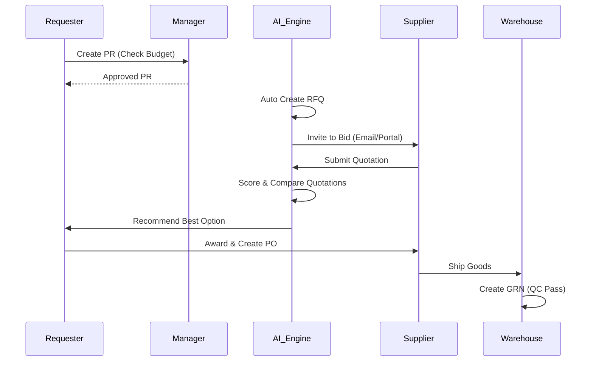

# 🚀 Smart E-Procurement & Order Management System (OMS)

[](https://nextjs.org/)
[](https://nestjs.com/)
[](https://www.prisma.io/)
[](https://www.postgresql.org/)
[](https://redis.io/)
[](https://ai.google.dev/)

Hệ thống quản trị mua sắm tập trung (**E-Procurement**) và Quản lý đơn hàng (**OMS**) toàn diện, tiên phong trong việc tích hợp Trí tuệ nhân tạo (AI) để tối ưu hóa toàn bộ chu trình từ yêu cầu mua sắm đến thanh toán (**Procure-to-Pay**). Dự án được thiết kế với kiến trúc hiện đại, module hóa cao và giao diện người dùng theo chuẩn Enterprise.

---

## 📑 Mục lục (Table of Contents)
1. [🏗️ Kiến trúc Hệ thống (Architecture)](#-kiến-trúc-hệ-thống)
2. [🧠 CPO Virtual Assistant (AI Intelligence)](#-cpo-virtual-assistant-ai-intelligence)
3. [⚙️ Enterprise Automation Engine](#️-enterprise-automation-engine)
4. [🛡️ Bảo mật & Tuân thủ (Security)](#️-bảo-mật--tuân-thủ)
5. [🧩 Các Module Nghiệp vụ (Modules)](#-các-module-nghiệp-vụ)
6. [🔄 Quy trình Procure-to-Pay (Mermaid)](#-quy-trình-procure-to-pay)
7. [🛠️ Hướng dẫn Cài đặt (Installation)](#️-hướng-dẫn-cài-đặt)

---

## 🏗️ Kiến trúc Hệ thống (System Architecture)

Hệ thống được xây dựng trên mô hình **Separation of Concerns**, đảm bảo tính độc lập và khả năng mở rộng:

*   **Frontend (`/client`)**:
    *   **Core:** Next.js 15 (React 19) với App Router.
    *   **UI/UX:** Tailwind CSS 4, Lucide Icons, Shadcn-like components.
    *   **State Management:** React Context API (`ProcurementProvider`) kết hợp kiến trúc tập trung hóa DTOs và Type-safety tuyệt đối.
*   **Backend (`/server`)**:
    *   **Framework:** NestJS (Node.js) - Kiến trúc Module-based.
    *   **ORM:** Prisma với PostgreSQL 16 (Hỗ trợ Transaction, Indexing chuyên sâu).
    *   **Background Jobs:** Redis + BullMQ xử lý thông báo, email và tự động hóa chứng từ.
    *   **Real-time:** Socket.io đồng bộ trạng thái đơn hàng và thông báo tức thời.

---

## 🧠 CPO Virtual Assistant (AI Intelligence)

Tích hợp **Google Gemini 1.5 Flash**, hệ thống sở hữu một "Giám đốc Thu mua ảo" (CPO) hỗ trợ ra quyết định thông minh:

1.  **AI Function Calling**: AI có khả năng tự truy vấn database (PR, PO, KPI nhà cung cấp) thông qua các công cụ được định nghĩa sẵn để trả lời câu hỏi bằng ngôn ngữ tự nhiên.
2.  **Quotation Analysis Engine**:
    *   Tự động chấm điểm báo giá trên thang 100.
    *   Trọng số linh hoạt: **Giá (40%)**, **Tiến độ (30%)**, **Uy tín (30%)**.
    *   Tóm tắt ưu/nhược điểm và đưa ra đề xuất (Recommend/Reject).
3.  **Supplier Selection AI**: Phân tích lịch sử giao dịch và KPI thực tế để gợi ý nhà cung cấp tối ưu nhất cho từng mặt hàng (SKU).

---

## ⚙️ Enterprise Automation Engine

Quy trình vận hành được tự động hóa thông qua `AutomationService` và `BullMQ`:

*   **Auto-Trigger**: Khi PR được duyệt hoàn toàn -> Tự động khởi tạo RFQ.
*   **Supplier Invitation**: Hệ thống tự gửi Email mời thầu tới các nhà cung cấp được AI gợi ý.
*   **PO Issuance**: Khi chọn báo giá (Awarded) -> Tự động tạo PO & Soft Commit ngân sách.
*   **GRN Generation**: Sau khi PO được phát hành -> Tự động tạo bản ghi Nhập kho (Draft GRN) để chuẩn bị đối soát.
*   **Budget Integrity**: Tự động cập nhật `Allocated` -> `Committed` -> `Spent` xuyên suốt vòng đời chứng từ.

---

## 🛡️ Bảo mật & Tuân thủ (Security & Compliance)

*   **Xác thực**: JWT (JSON Web Token) với cơ chế Access/Refresh token bảo mật cao.
*   **Phân quyền (RBAC)**: Hệ thống vai trò phân tầng: `REQUESTER`, `DEPT_APPROVER`, `DIRECTOR`, `CEO`, `PROCUREMENT`, `FINANCE`, `WAREHOUSE`, `PLATFORM_ADMIN`.
*   **Security Middleware**: Helmet.js bảo vệ header, Throttler chống DDoS, và ValidationPipe chuẩn hóa dữ liệu đầu vào.
*   **Audit Logging**: `audit-module` ghi lại mọi dấu vết thay đổi dữ liệu (Ai thay đổi? Lúc nào?) phục vụ hậu kiểm.

---

## 🧩 Các Module Nghiệp vụ (Business Domains)

### 🛒 Thu mua & Sourcing
*   **`prmodule`**: Quản lý nhu cầu, kiểm soát hạn mức theo cấp bậc.
*   **`rfqmodule`**: So sánh giá, đấu thầu minh bạch.
*   **`supplier-kpimodule`**: Đánh giá OTD (Giao hàng đúng hạn), Quality, và Trust Score.

### 💰 Tài chính & Kiểm soát
*   **`budget-module`**: Quản lý ngân sách theo năm/quý/bộ phận.
*   **`approval-module`**: Ma trận phê duyệt động (Dynamic Approval Matrix) dựa trên ngưỡng giá trị chứng từ.
*   **`invoice-module`**: Đối soát 3 bên (3-Way Matching: PO - GRN - Invoice).

### 📦 Kho & Vận hành
*   **`grnmodule`**: Quy trình nhận hàng và kiểm soát chất lượng (QC).
*   **`dispute-module`**: Xử lý sai lệch hàng hóa, hàng lỗi hoặc tranh chấp thanh toán.

---

## 🔄 Quy trình Procure-to-Pay



---

## 🛠️ Hướng dẫn Cài đặt

### Yêu cầu tiên quyết
- **Node.js**: v18.x hoặc cao hơn.
- **Docker**: (Khuyên dùng để chạy PostgreSQL & Redis).
- **Google Cloud API Key**: Để sử dụng tính năng Gemini AI.

### Bước 1: Thiết lập Cơ sở dữ liệu & Caching
```bash
# Sử dụng Docker để khởi tạo nhanh
docker run --name pg-oms -e POSTGRES_PASSWORD=yourpass -p 5432:5432 -d postgres
docker run --name redis-oms -p 6379:6379 -d redis
```

### Bước 2: Cài đặt Backend (`/server`)
```bash
cd server
npm install
# Tạo .env từ .env.example và điền các thông số
npx prisma generate
npx prisma migrate dev
npm run start:dev
```

### Bước 3: Cài đặt Frontend (`/client`)
```bash
cd client
npm install
npm run dev
```

### 📋 Biến môi trường (.env) quan trọng
| Biến | Mô tả | Mặc định |
| :--- | :--- | :--- |
| `DATABASE_URL` | Kết nối PostgreSQL | `postgresql://...` |
| `REDIS_HOST` | Địa chỉ máy chủ Redis | `localhost` |
| `GEMINI_API_KEY` | Key từ Google AI Studio | `Required` |
| `JWT_SECRET` | Khóa bảo mật Token | `Random String` |

---
*Tài liệu được xây dựng chuyên nghiệp nhằm phục vụ việc bàn giao và phát triển bền vững.*
