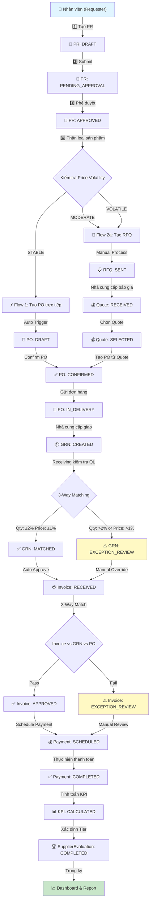
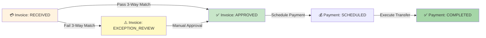
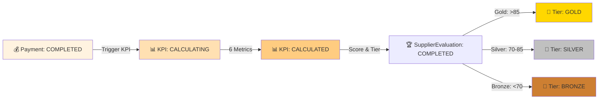
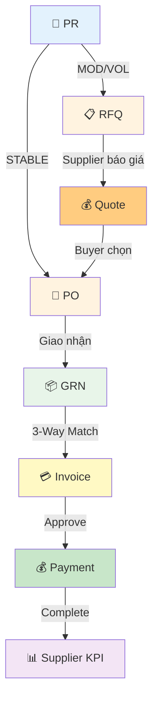

# 📋 COMPLETE PROCUREMENT FLOW: Từ PR → GRN → Payment → KPI Evaluation

**Ngày cập nhật:** April 5, 2026  
**Phiên bản:** 2.0 - Complete End-to-End Flow  
**Mô tả:** Quy trình chi tiết từ lúc tạo Purchase Requisition (PR) đến khi đánh giá nhà cung cấp (KPI Evaluation)

---

## 📊 SƠ ĐỒ CHUNG TOÀN BỘ QUY TRÌNH



---

## 🔵 FLOW 1: STABLE PRODUCTS (Giá ổn định - Tạo PO trực tiếp)

**Đặc điểm:** `PriceVolatility = STABLE`, `requiresQuoteFirst = false`

### 📊 Diagram Flow 1

```mermaid
graph LR
    A["📝 PR: APPROVED<br/>Sản phẩm STABLE"] -->|Auto Trigger<br/>AutomationService| B["📄 PO: DRAFT<br/>Tạo tự động"]
    B -->|Business Logic:<br/>Xác nhận PO| C["✅ PO: CONFIRMED<br/>GRN có thể nhận"]
    C -->|Nhà cung cấp giao| D["📦 GRN: MATCHED<br/>Auto Approved"]
    D -->|Auto Approve| E["💳 Invoice: APPROVED<br/>Sẵn sàng thanh toán"]
    E -->|Xử lý Payment| F["✅ Payment: COMPLETED"]
    
    style A fill:#e3f2fd
    style B fill:#fff3e0
    style C fill:#c8e6c9
    style D fill:#c8e6c9
    style E fill:#c8e6c9
    style F fill:#a5d6a7
```



### 📝 Trạng thái chuyển đổi trong Flow 1

| Documento | Trạng thái | Điều kiện chuyển | Hệ thống xử lý |
|-----------|-----------|-----------------|-----------------|
| **PR** | DRAFT → APPROVED | Phê duyệt từ Manager/Director | ApprovalService.approvePr() |
| **PO** (Auto) | DRAFT → CONFIRMED | Auto trigger sau PR APPROVED | AutomationService.checkAndCreatePO() |
| **GRN** | CREATED → MATCHED | Qty: ±2%, Price: ±1% | ReceivingService.validate3WayMatch() |
| **Invoice** | RECEIVED → APPROVED | Match GRN, Pass tolerance | InvoiceService.approveInvoice() |
| **Payment** | SCHEDULED → COMPLETED | Xử lý thanh toán | PaymentService.processPayment() |

### 💻 Code xử lý Flow 1

#### 1. AutomationService - Auto Create PO for STABLE products
```typescript
// server/src/automation/automation.service.ts

async checkAndCreatePO(prId: string): Promise<void> {
  // B1: Lấy PR chi tiết
  const pr = await this.prisma.purchaseRequisition.findUnique({
    where: { id: prId },
    include: {
      items: {
        include: {
          product: true,
          supplier: true,
        },
      },
    },
  });

  if (pr.status !== PrStatus.APPROVED) return;

  // B2: Kiểm tra tất cả items có phải STABLE không
  const allStable = pr.items.every(
    item => item.product.priceVolatility === PriceVolatility.STABLE
  );

  if (!allStable) {
    // Nếu có product MODERATE/VOLATILE, tạo RFQ thay vì PO
    await this.createRFQ(prId);
    return;
  }

  // B3: Tạo PO từ PR
  const po = await this.prisma.purchaseOrder.create({
    data: {
      poNumber: `PO-${Date.now()}`,
      prId: pr.id,
      supplierId: pr.items[0].supplierId,
      orgId: pr.orgId,
      status: PoStatus.DRAFT,
      totalAmount: pr.items.reduce((sum, item) => 
        sum + (item.quantity * item.unitPrice), 0
      ),
      items: {
        create: pr.items.map(item => ({
          productId: item.productId,
          quantity: item.quantity,
          unitPrice: item.unitPrice,
          lineTotal: item.quantity * item.unitPrice,
        })),
      },
    },
  });

  // B4: Auto confirm PO cho STABLE
  await this.prisma.purchaseOrder.update({
    where: { id: po.id },
    data: { 
      status: PoStatus.CONFIRMED,
      confirmedAt: new Date(),
    },
  });

  // B5: Trigger event
  await this.eventEmitter.emit('po.confirmed', {
    poId: po.id,
    supplierId: pr.items[0].supplierId,
  });
}
```

#### 2. ReceivingService - Auto Validate GRN (3-Way Matching)
```typescript
// server/src/grn/receiving.service.ts

async createGRNWithAutoValidation(
  poId: string,
  grnItems: CreateGRNItemDto[],
): Promise<GRN> {
  // B1: Lấy PO chi tiết
  const po = await this.prisma.purchaseOrder.findUnique({
    where: { id: poId },
    include: { items: true },
  });

  // B2: Kiểm tra 3-Way Matching
  const validation = await this.validate3WayMatch(
    po.items,
    grnItems,
  );

  // B3: Tạo GRN
  const grn = await this.prisma.grn.create({
    data: {
      grnNumber: `GRN-${Date.now()}`,
      poId: po.id,
      status: validation.passed 
        ? GrnStatus.MATCHED 
        : GrnStatus.EXCEPTION_REVIEW,
      receivedAt: new Date(),
      items: {
        create: grnItems.map(item => ({
          poItemId: item.poItemId,
          quantityReceived: item.quantityReceived,
          unitPrice: item.unitPrice,
        })),
      },
    },
  });

  // B4: Nếu pass, auto approve invoice
  if (validation.passed) {
    await this.invoiceService.autoApproveRelatedInvoice(poId);
  }

  return grn;
}

private async validate3WayMatch(
  poItems: POItem[],
  grnItems: GRNItemDto[],
): Promise<ValidationResult> {
  let qtyTolerance = 0.02; // 2%
  let priceTolerance = 0.01; // 1%
  let passed = true;
  let exceptions = [];

  for (const grnItem of grnItems) {
    const poItem = poItems.find(p => p.id === grnItem.poItemId);
    
    // Kiểm tra Quantity
    const qtyVariance = Math.abs(
      (grnItem.quantityReceived - poItem.quantity) / poItem.quantity
    );
    
    if (qtyVariance > qtyTolerance) {
      passed = false;
      exceptions.push({
        type: 'QUANTITY_VARIANCE',
        message: `Qty variance: ${(qtyVariance * 100).toFixed(2)}% > 2%`,
      });
    }

    // Kiểm tra Unit Price
    const priceVariance = Math.abs(
      (grnItem.unitPrice - poItem.unitPrice) / poItem.unitPrice
    );
    
    if (priceVariance > priceTolerance) {
      passed = false;
      exceptions.push({
        type: 'PRICE_VARIANCE',
        message: `Price variance: ${(priceVariance * 100).toFixed(2)}% > 1%`,
      });
    }
  }

  return { passed, exceptions };
}
```

---

## 🟡 FLOW 2: MODERATE & VOLATILE PRODUCTS (Yêu cầu báo giá)

**Đặc điểm:** 
- MODERATE: `requiresQuoteFirst = true` (báo giá tùy chọn)
- VOLATILE: `requiresQuoteFirst = true` (báo giá bắt buộc)

### 📊 Diagram Flow 2

```mermaid
graph LR
    A["📝 PR: APPROVED<br/>MODERATE/VOLATILE"] -->|AutomationService| B["📋 RFQ: DRAFT<br/>Tạo Request for Quotation"]
    B -->|Send to Suppliers| C["📋 RFQ: SENT"]
    C -->|Nhà cung cấp phản hồi| D["💰 Quote: RECEIVED"]
    D -->|Buyer chọn Quote| E["💰 Quote: SELECTED"]
    E -->|Tạo PO từ Quote| F["📄 PO: DRAFT"]
    F -->|Manual Confirm| G["✅ PO: CONFIRMED"]
    G -->|Giao nhận| H["📦 GRN: CREATED"]
    H -->|Validate| I{3-Way Match?}
    I -->|Pass| J["✅ GRN: MATCHED"]
    I -->|Fail| K["⚠️ EXCEPTION_REVIEW"]
    J -->|Approve| L["💳 Invoice: APPROVED"]
    K -->|Manual| L
    
    style A fill:#fff3e0
    style B fill:#ffe0b2
    style C fill:#ffe0b2
    style D fill:#ffcc80
    style E fill:#ffb74d
    style F fill:#fff3e0
    style G fill:#c8e6c9
    style L fill:#c8e6c9
```



### 📝 Trạng thái chuyển đổi trong Flow 2

| Documento | Trạng thái | Điều kiện chuyển | Hệ thống xử lý |
|-----------|-----------|-----------------|-----------------|
| **PR** | DRAFT → APPROVED | Phê duyệt từ Manager | ApprovalService.approvePr() |
| **RFQ** | DRAFT → SENT | Gửi tới nhà cung cấp | RFQService.sendRFQ() |
| **Quote** | RECEIVED → SELECTED | Buyer chọn Quote | QuoteService.selectQuote() |
| **PO** (Manual) | DRAFT → CONFIRMED | Buyer confirm PO | PurchaseOrderService.confirmPO() |
| **GRN** | CREATED → MATCHED | Pass 3-Way Matching | ReceivingService.validate() |
| **Invoice** | RECEIVED → APPROVED | Match GRN & PO | InvoiceService.approveInvoice() |

### 💻 Code xử lý Flow 2

#### 1. RFQService - Tạo Request for Quotation
```typescript
// server/src/rfq/rfq.service.ts

async createRFQFromPR(prId: string): Promise<RFQ> {
  // B1: Lấy PR và kiểm tra có MODERATE/VOLATILE không
  const pr = await this.prisma.purchaseRequisition.findUnique({
    where: { id: prId },
    include: {
      items: {
        include: { product: true },
      },
    },
  });

  const requiresQuote = pr.items.some(
    item => item.product.requiresQuoteFirst
  );

  if (!requiresQuote) {
    throw new BadRequestException(
      'Only MODERATE/VOLATILE products require RFQ'
    );
  }

  // B2: Tạo RFQ
  const rfq = await this.prisma.rfq.create({
    data: {
      rfqNumber: `RFQ-${Date.now()}`,
      prId: pr.id,
      orgId: pr.orgId,
      status: RFQStatus.DRAFT,
      items: {
        create: pr.items.map(item => ({
          productId: item.productId,
          quantity: item.quantity,
          description: item.description,
        })),
      },
    },
  });

  return rfq;
}

async sendRFQToSuppliers(
  rfqId: string,
  supplierIds: string[],
): Promise<void> {
  // B1: Update RFQ status
  await this.prisma.rfq.update({
    where: { id: rfqId },
    data: { status: RFQStatus.SENT },
  });

  // B2: Tạo RFQ responses cho mỗi supplier
  for (const supplierId of supplierIds) {
    await this.prisma.rfqResponse.create({
      data: {
        rfqId,
        supplierId,
        status: RFQResponseStatus.PENDING,
      },
    });
  }

  // B3: Send email notifications
  await this.emailService.sendRFQToSuppliers(rfqId, supplierIds);
}
```

#### 2. QuoteService - Xử lý nhà cung cấp báo giá
```typescript
// server/src/quote/quote.service.ts

async receiveSupplierQuote(
  rfqId: string,
  supplierId: string,
  quoteItems: QuoteItemDto[],
): Promise<Quote> {
  // B1: Tạo Quote
  const quote = await this.prisma.quote.create({
    data: {
      quoteNumber: `QUOTE-${Date.now()}`,
      rfqId,
      supplierId,
      status: QuoteStatus.RECEIVED,
      totalAmount: quoteItems.reduce((sum, item) => 
        sum + (item.quotedQty * item.quotedPrice), 0
      ),
      items: {
        create: quoteItems.map(item => ({
          rfqItemId: item.rfqItemId,
          quotedQty: item.quotedQty,
          quotedPrice: item.quotedPrice,
          leadTime: item.leadTime,
        })),
      },
    },
  });

  return quote;
}

async selectQuoteAndCreatePO(
  quoteId: string,
): Promise<PurchaseOrder> {
  // B1: Lấy Quote và update status
  const quote = await this.prisma.quote.findUnique({
    where: { id: quoteId },
    include: {
      items: true,
      rfq: {
        include: {
          pr: {
            include: { items: true },
          },
        },
      },
    },
  });

  await this.prisma.quote.update({
    where: { id: quoteId },
    data: { status: QuoteStatus.SELECTED },
  });

  // B2: Tạo PO từ Quote
  const po = await this.prisma.purchaseOrder.create({
    data: {
      poNumber: `PO-${Date.now()}`,
      prId: quote.rfq.prId,
      supplierId: quote.supplierId,
      quoteId: quote.id,
      status: PoStatus.DRAFT,
      totalAmount: quote.totalAmount,
      items: {
        create: quote.items.map(item => ({
          productId: quote.rfq.pr.items.find(
            prItem => prItem.id === item.rfqItemId
          )?.productId,
          quantity: item.quotedQty,
          unitPrice: item.quotedPrice,
        })),
      },
    },
  });

  return po;
}
```

---

## 📦 CHI TIẾT: RECEIVING & 3-WAY MATCHING (GRN)

### 🎯 Bước 1: Nhận hàng (Goods Received Note)

```typescript
// server/src/grn/grn.service.ts

async createGRN(
  poId: string,
  grnItems: CreateGRNItemDto[],
  receivedBy: string,
): Promise<GRN> {
  // B1: Lấy PO
  const po = await this.prisma.purchaseOrder.findUnique({
    where: { id: poId },
    include: {
      items: {
        include: {
          invoice: true,
        },
      },
      pr: {
        include: {
          items: {
            include: { product: true },
          },
        },
      },
    },
  });

  // B2: Auto check nếu tất cả items là STABLE
  const allStable = po.pr.items.every(
    item => item.product.priceVolatility === PriceVolatility.STABLE
  );

  // B3: Validate 3-Way Matching
  const matchResult = await this.validate3WayMatch(po, grnItems);

  // B4: Tạo GRN
  const grn = await this.prisma.grn.create({
    data: {
      grnNumber: `GRN-${Date.now()}`,
      poId,
      status: matchResult.passed 
        ? GrnStatus.MATCHED 
        : GrnStatus.EXCEPTION_REVIEW,
      matchDetails: matchResult.details,
      receivedBy,
      receivedAt: new Date(),
      items: {
        create: grnItems,
      },
    },
  });

  // B5: Nếu tất cả STABLE và match pass, tự động approve GRN
  if (allStable && matchResult.passed) {
    await this.prisma.grn.update({
      where: { id: grn.id },
      data: { status: GrnStatus.APPROVED_AUTO },
    });

    // Trigger auto approve invoice
    await this.invoiceService.autoApproveInvoice(poId);
  }

  return grn;
}
```

### 🔍 Bước 2: 3-Way Matching Logic

```typescript
private async validate3WayMatch(
  po: PurchaseOrder,
  grnItems: CreateGRNItemDto[],
): Promise<MatchValidationResult> {
  const qtyTolerance = 0.02; // 2%
  const priceTolerance = 0.01; // 1%
  
  let passed = true;
  const details = {
    quantityMatches: [],
    priceMatches: [],
    exceptions: [],
  };

  for (const grnItem of grnItems) {
    const poItem = po.items.find(p => p.id === grnItem.poItemId);
    const invoiceItem = poItem?.invoice?.items?.find(
      i => i.poItemId === grnItem.poItemId
    );

    if (!poItem || !invoiceItem) continue;

    // ============================================
    // 3-Way Matching: GRN vs PO vs Invoice
    // ============================================

    // 1️⃣ PO Qty vs GRN Qty
    const qtyVariancePO = Math.abs(
      (grnItem.quantityReceived - poItem.quantity) / poItem.quantity
    );

    // 2️⃣ Invoice Qty vs GRN Qty
    const qtyVarianceInvoice = Math.abs(
      (grnItem.quantityReceived - invoiceItem.quantity) / invoiceItem.quantity
    );

    // 3️⃣ Price PO vs GRN
    const priceVariancePO = Math.abs(
      (grnItem.unitPrice - poItem.unitPrice) / poItem.unitPrice
    );

    // 4️⃣ Price Invoice vs GRN
    const priceVarianceInvoice = Math.abs(
      (grnItem.unitPrice - invoiceItem.unitPrice) / invoiceItem.unitPrice
    );

    // Kiểm tra tolerance
    const qtyOK = Math.max(qtyVariancePO, qtyVarianceInvoice) <= qtyTolerance;
    const priceOK = Math.max(priceVariancePO, priceVarianceInvoice) <= priceTolerance;

    if (qtyOK && priceOK) {
      details.quantityMatches.push({
        poItemId: grnItem.poItemId,
        status: 'PASS',
        variance: Math.max(qtyVariancePO, qtyVarianceInvoice),
      });
    } else {
      passed = false;
      if (!qtyOK) {
        details.exceptions.push({
          type: 'QUANTITY_VARIANCE',
          poItemId: grnItem.poItemId,
          message: `Qty variance: ${(Math.max(qtyVariancePO, qtyVarianceInvoice) * 100).toFixed(2)}%`,
        });
      }
      if (!priceOK) {
        details.exceptions.push({
          type: 'PRICE_VARIANCE',
          poItemId: grnItem.poItemId,
          message: `Price variance: ${(Math.max(priceVariancePO, priceVarianceInvoice) * 100).toFixed(2)}%`,
        });
      }
    }
  }

  return { passed, details };
}
```

---

## 💳 CHI TIẾT: INVOICE & PAYMENT

### 📋 Trạng thái Invoice



### 💻 Code xử lý Invoice

```typescript
// server/src/invoice/invoice.service.ts

async approveInvoice(invoiceId: string): Promise<Invoice> {
  // B1: Lấy Invoice
  const invoice = await this.prisma.invoice.findUnique({
    where: { id: invoiceId },
    include: {
      po: {
        include: { items: true },
      },
      grn: {
        include: { items: true },
      },
    },
  });

  // B2: 3-Way Matching (PO, GRN, Invoice)
  let matchingOK = true;
  let exceptions = [];

  for (const invItem of invoice.items) {
    const poItem = invoice.po.items.find(p => p.id === invItem.poItemId);
    const grnItem = invoice.grn.items.find(g => g.poItemId === invItem.poItemId);

    if (!poItem || !grnItem) {
      matchingOK = false;
      exceptions.push({
        invoiceItemId: invItem.id,
        message: 'No matching PO or GRN item',
      });
      continue;
    }

    // Kiểm tra amount
    const tolerance = 0.01; // 1%
    const variance = Math.abs(
      (invItem.lineTotal - poItem.lineTotal) / poItem.lineTotal
    );

    if (variance > tolerance) {
      matchingOK = false;
      exceptions.push({
        invoiceItemId: invItem.id,
        message: `Amount variance: ${(variance * 100).toFixed(2)}%`,
      });
    }
  }

  // B3: Update Invoice status
  const status = matchingOK 
    ? InvoiceStatus.APPROVED 
    : InvoiceStatus.EXCEPTION_REVIEW;

  const updatedInvoice = await this.prisma.invoice.update({
    where: { id: invoiceId },
    data: {
      status,
      approvedAt: matchingOK ? new Date() : null,
      exceptions: exceptions.length > 0 ? exceptions : null,
    },
  });

  // B4: Nếu approve, tạo Payment Record
  if (matchingOK) {
    await this.paymentService.schedulePayment(invoiceId);
  }

  return updatedInvoice;
}
```

### 💰 Code xử lý Payment

```typescript
// server/src/payment/payment.service.ts

async schedulePayment(invoiceId: string): Promise<PaymentRecord> {
  // B1: Lấy Invoice
  const invoice = await this.prisma.invoice.findUnique({
    where: { id: invoiceId },
    include: {
      po: {
        include: { supplier: true },
      },
    },
  });

  // B2: Tạo Payment Record
  const payment = await this.prisma.paymentRecord.create({
    data: {
      paymentNumber: `PAY-${Date.now()}`,
      invoiceId,
      supplierId: invoice.po.supplierId,
      amount: invoice.totalAmount,
      status: PaymentStatus.SCHEDULED,
      scheduledDate: new Date(Date.now() + 7 * 24 * 60 * 60 * 1000), // 7 days
      paymentMethod: PaymentMethod.BANK_TRANSFER,
    },
  });

  // B3: Trigger payment queue job (BullMQ)
  await this.paymentQueue.add(
    'execute-payment',
    {
      paymentId: payment.id,
      supplierId: invoice.po.supplierId,
      amount: invoice.totalAmount,
    },
    {
      delay: 7 * 24 * 60 * 60 * 1000, // Execute sau 7 ngày
    },
  );

  return payment;
}

async executePayment(paymentId: string): Promise<PaymentRecord> {
  // B1: Lấy Payment Record
  const payment = await this.prisma.paymentRecord.findUnique({
    where: { id: paymentId },
    include: {
      invoice: {
        include: { po: true },
      },
    },
  });

  // B2: Gọi Banking API (ngoài hệ thống)
  const transferResult = await this.bankingService.transferFunds({
    recipientBank: payment.invoice.po.supplier.bankCode,
    recipientAccount: payment.invoice.po.supplier.bankAccount,
    amount: payment.amount,
    description: `Payment for Invoice: ${payment.invoice.invoiceNumber}`,
  });

  // B3: Update status
  const updated = await this.prisma.paymentRecord.update({
    where: { id: paymentId },
    data: {
      status: PaymentStatus.COMPLETED,
      completedAt: new Date(),
      transactionRef: transferResult.transactionId,
    },
  });

  // B4: Trigger KPI Calculation
  await this.eventEmitter.emit('payment.completed', {
    supplierId: payment.supplierId,
    amount: payment.amount,
    invoiceId: paymentId,
  });

  return updated;
}
```

---

## 📊 CHI TIẾT: SUPPLIER EVALUATION & KPI

### 🏆 Trạng thái Supplier Evaluation



### 📈 6 Tiêu chí KPI

| # | Tiêu chí | Công thức tính | Trọng số | Ghi chú |
|---|----------|---------------|---------|---------|
| 1️⃣ | **On-Time Delivery** | (Delivered on time / Total POs) × 100% | 25% | Kiểm tra GRN date vs PO expected date |
| 2️⃣ | **Quality Score** | (Perfect GRN / Total GRNs) × 100% | 20% | % GRN pass 3-way matching without exception |
| 3️⃣ | **Price Competitiveness** | (Supplier Avg Price / Market Avg Price) | 20% | So sánh với market benchmark |
| 4️⃣ | **Invoice Accuracy** | (Accurate Invoice / Total Invoice) × 100% | 15% | % Invoice pass first time approval |
| 5️⃣ | **Responsiveness** | (Quote within SLA / Total RFQ) × 100% | 10% | % RFQ response trong 24h |
| 6️⃣ | **Order Fulfillment** | (Fulfilled items / Total items) × 100% | 10% | % Item delivery trong chu kỳ |

### 💻 Code xử lý KPI Calculation

```typescript
// server/src/kpi/kpi-calculator.service.ts

async calculateSupplierKPI(
  supplierId: string,
  quarterStart: Date,
  quarterEnd: Date,
): Promise<SupplierKPIResult> {
  // ================================================
  // 1️⃣ On-Time Delivery (25%)
  // ================================================
  const deliveryMetric = await this.calculateOnTimeDelivery(
    supplierId,
    quarterStart,
    quarterEnd,
  );

  // ================================================
  // 2️⃣ Quality Score (20%) - 3-Way Matching
  // ================================================
  const qualityMetric = await this.calculateQualityScore(
    supplierId,
    quarterStart,
    quarterEnd,
  );

  // ================================================
  // 3️⃣ Price Competitiveness (20%)
  // ================================================
  const priceMetric = await this.calculatePriceCompetitiveness(
    supplierId,
    quarterStart,
    quarterEnd,
  );

  // ================================================
  // 4️⃣ Invoice Accuracy (15%)
  // ================================================
  const invoiceMetric = await this.calculateInvoiceAccuracy(
    supplierId,
    quarterStart,
    quarterEnd,
  );

  // ================================================
  // 5️⃣ Responsiveness (10%) - RFQ Time
  // ================================================
  const responsivenessMetric = await this.calculateResponsiveness(
    supplierId,
    quarterStart,
    quarterEnd,
  );

  // ================================================
  // 6️⃣ Order Fulfillment (10%) - Delivery Rate
  // ================================================
  const fulfillmentMetric = await this.calculateOrderFulfillment(
    supplierId,
    quarterStart,
    quarterEnd,
  );

  // ================================================
  // TÍNH WEIGHTED SCORE
  // ================================================
  const totalScore =
    deliveryMetric.score * 0.25 +
    qualityMetric.score * 0.20 +
    priceMetric.score * 0.20 +
    invoiceMetric.score * 0.15 +
    responsivenessMetric.score * 0.10 +
    fulfillmentMetric.score * 0.10;

  // ================================================
  // PHÂN LOẠI SUPPLIER TIER
  // ================================================
  let tier: SupplierTier;
  if (totalScore >= 85) {
    tier = SupplierTier.GOLD;
  } else if (totalScore >= 70) {
    tier = SupplierTier.SILVER;
  } else {
    tier = SupplierTier.BRONZE;
  }

  return {
    supplierId,
    quarter: `${quarterStart.getFullYear()}Q${Math.ceil((quarterStart.getMonth() + 1) / 3)}`,
    score: totalScore,
    tier,
    metrics: {
      onTimeDelivery: deliveryMetric,
      qualityScore: qualityMetric,
      priceCompetitiveness: priceMetric,
      invoiceAccuracy: invoiceMetric,
      responsiveness: responsivenessMetric,
      orderFulfillment: fulfillmentMetric,
    },
  };
}

// Metric 1: On-Time Delivery
private async calculateOnTimeDelivery(
  supplierId: string,
  start: Date,
  end: Date,
): Promise<MetricResult> {
  const pos = await this.prisma.purchaseOrder.findMany({
    where: {
      supplierId,
      createdAt: { gte: start, lte: end },
    },
    include: {
      grn: true,
    },
  });

  let onTime = 0;
  let total = 0;

  for (const po of pos) {
    if (!po.grn) continue;
    total++;
    
    // Expected delivery date (từ PO data hoặc lead time)
    const expectedDate = new Date(
      po.createdAt.getTime() + po.expectedLeadTimeDays * 24 * 60 * 60 * 1000
    );
    
    // Actual delivery date (GRN received)
    const actualDate = po.grn.receivedAt;

    if (actualDate <= expectedDate) {
      onTime++;
    }
  }

  const percentage = total > 0 ? (onTime / total) * 100 : 0;

  return {
    metric: 'On-Time Delivery',
    score: percentage, // 0-100
    total,
    successful: onTime,
    details: { onTime, total },
  };
}

// Metric 2: Quality Score (3-Way Matching)
private async calculateQualityScore(
  supplierId: string,
  start: Date,
  end: Date,
): Promise<MetricResult> {
  const grns = await this.prisma.grn.findMany({
    where: {
      po: {
        supplierId,
        createdAt: { gte: start, lte: end },
      },
    },
  });

  let perfectGRN = 0;

  for (const grn of grns) {
    // GRN MATCHED = Pass 3-way matching
    if (grn.status === GrnStatus.MATCHED) {
      perfectGRN++;
    }
  }

  const percentage = grns.length > 0 ? (perfectGRN / grns.length) * 100 : 0;

  return {
    metric: 'Quality Score',
    score: percentage,
    total: grns.length,
    successful: perfectGRN,
    details: { perfectGRN, total: grns.length },
  };
}

// Metric 3: Price Competitiveness
private async calculatePriceCompetitiveness(
  supplierId: string,
  start: Date,
  end: Date,
): Promise<MetricResult> {
  // Lấy tất cả PO items từ supplier
  const supplierPOs = await this.prisma.purchaseOrder.findMany({
    where: {
      supplierId,
      createdAt: { gte: start, lte: end },
    },
    include: { items: true },
  });

  let supplierTotalPrice = 0;
  let supplierTotalQty = 0;

  for (const po of supplierPOs) {
    for (const item of po.items) {
      supplierTotalPrice += item.lineTotal;
      supplierTotalQty += item.quantity;
    }
  }

  // Lấy market average price (từ supplier khác cùng product)
  // Ví dụ: trung bình giá từ tất cả suppliers khác
  const competitorPOs = await this.prisma.purchaseOrder.findMany({
    where: {
      supplierId: { not: supplierId },
      createdAt: { gte: start, lte: end },
    },
    include: { items: true },
  });

  let marketTotalPrice = 0;
  let marketTotalQty = 0;

  for (const po of competitorPOs) {
    for (const item of po.items) {
      marketTotalPrice += item.lineTotal;
      marketTotalQty += item.quantity;
    }
  }

  const supplierAvgPrice = supplierTotalQty > 0 
    ? supplierTotalPrice / supplierTotalQty 
    : 0;
  const marketAvgPrice = marketTotalQty > 0 
    ? marketTotalPrice / marketTotalQty 
    : supplierAvgPrice;

  // Score: (Market Avg / Supplier Avg) * 100
  // Nếu supplier rẻ hơn market, sẽ score > 100
  const competitivenessScore = marketAvgPrice > 0 
    ? (marketAvgPrice / supplierAvgPrice) * 100 
    : 100;

  // Normalize to 0-100 (nếu > 100, cap ở 100)
  const normalizedScore = Math.min(competitivenessScore, 100);

  return {
    metric: 'Price Competitiveness',
    score: normalizedScore,
    details: {
      supplierAvgPrice,
      marketAvgPrice,
      ratio: competitivenessScore.toFixed(2),
    },
  };
}

// Metric 4: Invoice Accuracy
private async calculateInvoiceAccuracy(
  supplierId: string,
  start: Date,
  end: Date,
): Promise<MetricResult> {
  const invoices = await this.prisma.invoice.findMany({
    where: {
      po: {
        supplierId,
        createdAt: { gte: start, lte: end },
      },
    },
  });

  let accurateInvoices = 0;

  for (const invoice of invoices) {
    // Accurate = APPROVED On first review (không EXCEPTION_REVIEW)
    if (invoice.status === InvoiceStatus.APPROVED) {
      accurateInvoices++;
    }
  }

  const percentage = invoices.length > 0 
    ? (accurateInvoices / invoices.length) * 100 
    : 0;

  return {
    metric: 'Invoice Accuracy',
    score: percentage,
    total: invoices.length,
    successful: accurateInvoices,
    details: { accurate: accurateInvoices, total: invoices.length },
  };
}

// Metric 5: Responsiveness (RFQ Response Time)
private async calculateResponsiveness(
  supplierId: string,
  start: Date,
  end: Date,
): Promise<MetricResult> {
  const quotes = await this.prisma.quote.findMany({
    where: {
      supplierId,
      createdAt: { gte: start, lte: end },
    },
    include: {
      rfq: true,
    },
  });

  const SLA_HOURS = 24; // Yêu cầu báo giá trong 24h
  let onTimequotes = 0;

  for (const quote of quotes) {
    const responseTime = 
      (quote.createdAt.getTime() - quote.rfq.createdAt.getTime()) / 
      (1000 * 60 * 60); // Convert to hours

    if (responseTime <= SLA_HOURS) {
      onTimequotes++;
    }
  }

  const percentage = quotes.length > 0 
    ? (onTimequotes / quotes.length) * 100 
    : 0;

  return {
    metric: 'Responsiveness',
    score: percentage,
    total: quotes.length,
    successful: onTimequotes,
  };
}

// Metric 6: Order Fulfillment Rate
private async calculateOrderFulfillment(
  supplierId: string,
  start: Date,
  end: Date,
): Promise<MetricResult> {
  const pos = await this.prisma.purchaseOrder.findMany({
    where: {
      supplierId,
      createdAt: { gte: start, lte: end },
    },
    include: {
      items: {
        include: { grnItems: true },
      },
    },
  });

  let totalItems = 0;
  let fulfilledItems = 0;

  for (const po of pos) {
    for (const item of po.items) {
      totalItems++;
      
      // Fulfilled = có GRN items nhận tương ứng
      if (item.grnItems && item.grnItems.length > 0) {
        fulfilledItems++;
      }
    }
  }

  const percentage = totalItems > 0 
    ? (fulfilledItems / totalItems) * 100 
    : 0;

  return {
    metric: 'Order Fulfillment',
    score: percentage,
    total: totalItems,
    successful: fulfilledItems,
  };
}
```

### 🏆 Code lưu KPI vào Database

```typescript
async saveSupplierEvaluation(
  supplierId: string,
  kpiResult: SupplierKPIResult,
): Promise<SupplierEvaluation> {
  // B1: Tạo SupplierEvaluation record
  const evaluation = await this.prisma.supplierEvaluation.create({
    data: {
      supplierId,
      evaluationPeriod: kpiResult.quarter,
      score: kpiResult.score,
      tier: kpiResult.tier,
      metrics: {
        onTimeDelivery: kpiResult.metrics.onTimeDelivery.score,
        qualityScore: kpiResult.metrics.qualityScore.score,
        priceCompetitiveness: kpiResult.metrics.priceCompetitiveness.score,
        invoiceAccuracy: kpiResult.metrics.invoiceAccuracy.score,
        responsiveness: kpiResult.metrics.responsiveness.score,
        orderFulfillment: kpiResult.metrics.orderFulfillment.score,
      },
      evaluationDate: new Date(),
    },
  });

  // B2: Update SupplierTier trên Organization
  await this.prisma.organization.update({
    where: { id: supplierId },
    data: {
      supplierTier: kpiResult.tier,
      trustScore: kpiResult.score,
    },
  });

  // B3: Emit event để trigger notifications
  await this.eventEmitter.emit('supplier.evaluated', {
    supplierId,
    tier: kpiResult.tier,
    score: kpiResult.score,
  });

  return evaluation;
}
```

---

## 📚 TỔNG KẾT TRẠNG THÁI DOCUMENT

### 📊 Complete Status Transition Matrix

```
┌─────────────────┬──────────────┬──────────────┬─────────────────┐
│  Document Type  │  Start State │  Auto/Manual │  End State      │
├─────────────────┼──────────────┼──────────────┼─────────────────┤
│ PR              │ DRAFT        │ Manual       │ APPROVED        │
│ PO (STABLE)     │ DRAFT        │ Auto         │ CONFIRMED       │
│ PO (MOD/VOL)    │ DRAFT        │ Manual       │ CONFIRMED       │
│ RFQ             │ DRAFT        │ Manual       │ SENT            │
│ Quote           │ PENDING      │ Manual       │ SELECTED        │
│ GRN             │ CREATED      │ Auto/Manual  │ MATCHED         │
│ Invoice         │ RECEIVED     │ Auto/Manual  │ APPROVED        │
│ Payment         │ SCHEDULED    │ Auto         │ COMPLETED       │
│ KPI             │ CALCULATING  │ Auto         │ COMPLETED       │
│ SupplierEval    │ PENDING      │ Auto         │ COMPLETED       │
└─────────────────┴──────────────┴──────────────┴─────────────────┘
```

---

## 🔗 TRẠNG THÁI LIÊN KẾT GIỮA CÁC DOCUMENT



---

## 📝 GHI CHÚ QUAN TRỌNG

### ✅ Các trường hợp AUTO (Tự động xử lý)
1. **📄 PO Auto Creation**: Khi PR có tất cả STABLE products → Auto create PO in DRAFT
2. **⚡ PO Auto Confirm**: Khi tất cả PO items là STABLE → Auto confirm PO
3. **✅ GRN Auto Match**: Khi 3-way matching pass (qty ±2%, price ±1%) → Auto MATCHED
4. **💳 Invoice Auto Approve**: Khi GRN MATCHED + Invoice match → Auto APPROVED
5. **💰 Payment Auto Execute**: Khi Payment date reached → Auto execute bank transfer
6. **📊 KPI Auto Calculate**: Khi Payment completed → Auto trigger KPI calculation

### ❌ Các trường hợp MANUAL (Cần duyệt xác nhận)
1. **PR Approval**: Manager/Director phê duyệt PR
2. **RFQ Send**: Buyer gửi request to suppliers (MOD/VOL products)
3. **Quote Selection**: Buyer chọn Quote từ suppliers
4. **PO Confirm**: Buyer confirm PO (MOD/VOL products)
5. **Exception Review**: GRN hoặc Invoice có variance → Manual override
6. **KPI Evaluation**: CEO/Procurement Manager review supplier tier

---

**Tài liệu được phát triển bởi:** Nguyễn Đình Nam  
**Liên hệ:** nguyendinhnam241209@gmail.com | 0908651852
